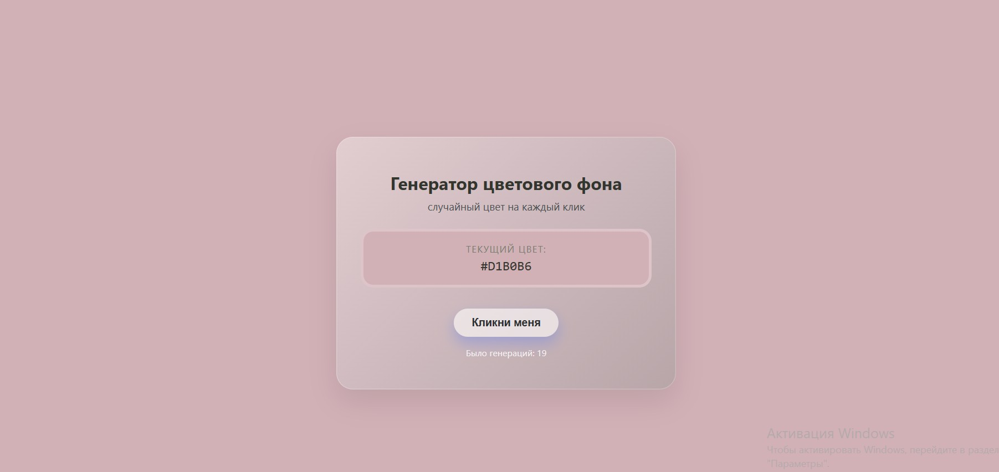
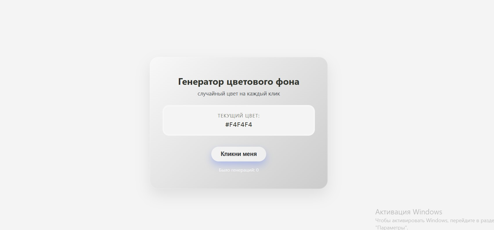
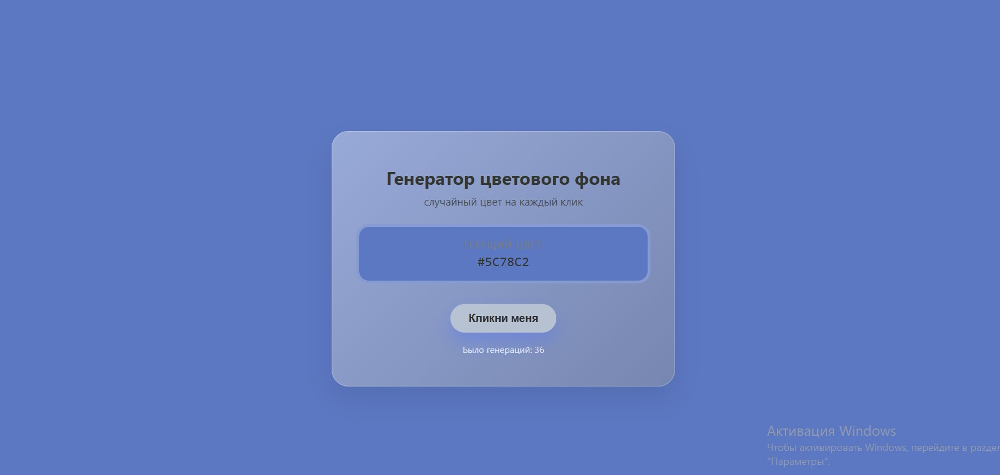

# Генератор цветового фона (кр4)

## Скриншоты






---

## О проекте

Небольшое React-приложение, которое генерирует случайный цвет фона по нажатию кнопки (или не кнопки).  
При каждом клике меняется цвет страницы и отображается его код.

Проект демонстрирует базовые возможности React.

---


## Основные возможности

- Генерация случайного цвета при нажатии кнопки  
- Изменение фона всей страницы на сгенерированный цвет  
- Отображение текущего цвета в формате `#RRGGBB`  
- Карточка с аккуратной версткой и адаптивной шириной  

---

## Запуск проекта

Чтобы запустить приложение локально, потребуется установленный **Node.js** и **Git**.

1. Клонировать репозиторий:

```bash
git clone https://github.com/hsugvusrihgvir/kr4_ipt.git
cd kr4_ipt
```

2. Установить зависимости:

```bash
npm install
```

3. Запустить дев-сервер:

```bash
npm start
```

Приложение будет доступно по адресу:  
[http://localhost:3000](http://localhost:3000)

